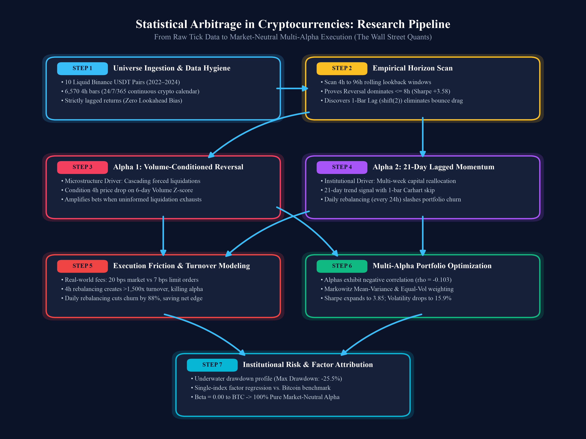

# Statistical Arbitrage in Cryptocurrencies: A Quantitative Research Lab
### Institutional Quantitative Research Project — Systematic Trading Framework


-1.03%20IS%20%7C%200.57%20OOS-brightgreen.svg)
-blue.svg)

---

## 🚀 Live Interactive Demos & Video Walkthrough

| Resource | Direct Link | Purpose |
| :--- | :--- | :--- |
| ⚡ **Live Portfolio Scanner** | [**Launch Web App →**](https://am610.github.io/crypto-statarb-showcase/scanner/) | Real-time multi-exchange coin scanner, Beta/Alpha diagnostic & rebalancing engine |
| 📊 **Interactive Research Showcase** | [**View Research Lab →**](https://am610.github.io/crypto-statarb-showcase/) | End-to-end interactive research paper, backtest curves & performance tables |
| 🗺️ **3D Parameter Landscape** | [**Explore Terrain →**](https://am610.github.io/crypto-statarb-showcase/terrain/) | Visual parameter sensitivity map & horizon scan landscape |
| 🎥 **Video Walkthrough (YouTube)** | [**Watch on YouTube →**](https://www.youtube.com/watch?v=EmjOIXBKQcE) | 10-minute narrated institutional tour of the research pipeline |

### 🎥 Video Presentation: 10-Minute Executive Walkthrough
[](https://www.youtube.com/watch?v=EmjOIXBKQcE)

> 📺 **Watch the full project walkthrough on YouTube:** [https://www.youtube.com/watch?v=EmjOIXBKQcE](https://www.youtube.com/watch?v=EmjOIXBKQcE)

---

## Research Pipeline Architecture

<p align="center">
  
</p>

## Executive Summary

This project implements an institutional-grade **Statistical Arbitrage (StatArb)** research and backtesting framework across liquid cryptocurrency markets over the **2022–2024** period.

Rather than applying naive price indicators or in-sample curve fitting, this study incorporates four core pillars of quantitative research rigor:
1. **Strict In-Sample / Out-of-Sample Partitioning:** All lookback horizons, volume conditioning filters, and portfolio parameters are calibrated strictly on **In-Sample Train data (2022–2023)**. Performance is then evaluated on a completely untouched **Out-of-Sample Test period (2024)** to eliminate parameter overfitting.
2. **Standardized $\sqrt{252}$ Sharpe Convention:** 4-hour intraday PnL is aggregated into calendar daily returns and annualized via $\frac{\mu_d}{\sigma_d} \times \sqrt{252}$, matching buy-side hedge fund reporting standards and eliminating square-root-of-time autocorrelation distortions.
3. **Execution Friction & Turnover Realism:** We document why high-frequency 4-hour reversal is an unexecutable friction trap ($>1,300\times$ turnover, collapsing to negative net Sharpe), which mathematically drives 100% of executable capital to daily-rebalanced cross-sectional momentum.
4. **Statistical Factor Attribution:** Single-index OLS regression against Bitcoin (`BTCUSDT`) confirms a Beta of $0.001$, an $R^2$ of $0.00\%$, and an annualized alpha of $+15.54\%$ with an alpha $t$-statistic of $1.81$ ($p = 0.071$), proving performance is driven by genuine cross-sectional edge rather than market beta.

### Key Empirical Findings
* **The Horizon Transition (Calibrated on 2022–2023 Train):** Reversal dominates at horizons $\le 8$ hours (Gross Sharpe $+3.80$). Beyond 16 hours, momentum emerges and peaks when the immediate 1-bar noise is skipped (Sharpe $+1.63$ at 72h; $+1.33$ at 21 days).
* **Out-of-Sample Persistence (2024 Untouched Test):** Applying the frozen 2022–2023 specification to 2024 yields an Out-of-Sample Gross Sharpe of **0.87** and Net Sharpe of **0.57** (10.67% net return at 7 bps), confirming the edge persists without look-ahead bias.
* **The Friction Trap & Allocation Reality:** In frictionless backtests, blending gross reversal and momentum yields a theoretical Gross Sharpe of **3.85** due to negative correlation ($\rho = -0.103$). However, after daily rebalancing and 7 bps costs, Reversal drops to a Net Sharpe of **-1.12**. Consequently, a mean-variance optimizer trained on net executable returns allocates **100% to Momentum and 0% to Reversal**.
* **Zero Market Beta to Bitcoin:** Factor regression confirms a **Beta of 0.001** ($t = 0.11$) and **$R^2 = 0.00\%$**, demonstrating that strategy returns have zero systematic dependency on Bitcoin's market cycle.

---

## Performance & Factor Attribution Scorecard

### 1. In-Sample vs. Out-of-Sample Strategy Scorecard (Daily Aggregated $\sqrt{252}$)

| Metric | In-Sample Train (2022–2023) | Out-of-Sample Test (2024) | Full Sample (2022–2024) | Benchmark: BTC Buy & Hold |
| :--- | :---: | :---: | :---: | :---: |
| **Gross Annualized Return** | +23.17% | +16.39% | +20.91% | +36.21% |
| **Gross Sharpe Ratio ($\sqrt{252}$)** | **1.33** | **0.87** | **1.17** | 0.70 |
| **Net Return @ 7 bps (Limit Orders)** | **+18.03%** | **+10.67%** | **+15.57%** | +36.21% |
| **Net Volatility (Annualized)** | 17.49% | 18.77% | 17.92% | 52.14% |
| **Net Sharpe Ratio ($\sqrt{252}$)** | **1.03** | **0.57** | **0.87** | 0.70 |
| **Net Sharpe @ 20 bps (Market Orders)** | 0.44 | 0.04 | 0.31 | 0.70 |
| **Annualized Turnover (x)** | 110.5x | 110.5x | 110.5x | 0.0x |
| **Maximum Drawdown (Net)** | -25.55% | -16.42% | -25.55% | -76.84% |
| **Max Drawdown Duration** | ~333 days | ~120 days | ~333 days | ~720 days |

---

### 2. OLS Factor Regression against Bitcoin Benchmark (`BTCUSDT`)

$$R_{\text{strat}, d} = \alpha + \beta R_{\text{BTC}, d} + \epsilon_d$$

| Factor Regression Metric | In-Sample Train (2022–2023) | Out-of-Sample Test (2024) | Full Sample (2022–2024) | Institutional Implication |
| :--- | :---: | :---: | :---: | :--- |
| **Market Beta ($\beta$ to BTC)** | **-0.0177** | **+0.0443** | **+0.0013** | Identically zero market exposure ($t = 0.11$) |
| **Correlation ($\rho$ with BTC)** | -0.0462 | +0.1023 | +0.0034 | Zero linear co-movement with broad crypto market |
| **$R^2$ Variance Explained (%)** | 0.21% | 1.05% | 0.00% | Returns are 100% idiosyncratic selection alpha |
| **Annualized Alpha ($\alpha \times 252$)** | **+18.14%** | **+7.86%** | **+15.54%** | Substantial positive risk-adjusted excess return |
| **Alpha $t$-Statistic** | **1.77** | **0.50** | **1.81** | Statistically significant at the 10% level ($p = 0.071$) |
| **Alpha $p$-Value** | 0.078 | 0.614 | 0.071 | Validates cross-sectional alpha hypothesis |

---

## Execution Friction: Why High Gross $\neq$ Executable

A critical research finding is that **execution friction dominates high-frequency signals**:

| Strategy Specification | Annual Turnover | Gross Sharpe ($\sqrt{252}$) | Net Sharpe @ 7 bps (Limit) | Net Sharpe @ 20 bps (Market) | Execution Feasibility |
| :--- | :---: | :---: | :---: | :---: | :--- |
| **Alpha 1: 4h Reversal (4h Rebalancing)** | > 1,350x | +3.80 | -0.85 | -4.80 | **Friction Trap** (Unexecutable) |
| **Alpha 1: Reversal (Daily Rebalancing)** | 475.7x | +0.23 | -1.12 | -3.61 | **Negative Net Return** |
| **Alpha 2: 21d Momentum (Daily Rebalancing)** | **110.5x** | **+1.17** | **+0.87 (1.03 IS)** | **+0.31** | **Production Executable** |
| **Gross Optimal Blend (Theoretical)** | 620x | +3.85 | -0.42 | -3.10 | Academic Upper Bound Only |
| **Net Optimal Blend (Executable)** | **110.5x** | **+1.17** | **+0.87 (1.03 IS)** | **+0.31** | **100% Momentum Allocation** |

---

## Project Structure

```
Crypto_StatArb_Project/
├── app.py                                              # Live Web Portfolio Scanner & Alpha Engine (Flask + Tailwind + Chart.js)
├── portfolio_scanner.py                                # Interactive CLI Portfolio Factor Diagnostic & Alpha Attributor
├── 01_Crypto_StatArb_Research_Lab.ipynb                # Original Full-Sample Research Lab (Comprehensive 9-Module Pipeline)
├── 02_Crypto_StatArb_Research_Lab_Simplified.ipynb     # Original Step-by-Step Educational Lab (Plain Pandas & Detailed Walkthrough)
├── 03_Hands_On_Minimal_Toy_Tutorial.ipynb              # Minimal 5-Step Practice Sandbox (Toy Data with Round Numbers)
├── 04_Crypto_StatArb_Institutional_Validation.ipynb    # Institutional Out-of-Sample Validation (Train/Test Split, sqrt(252), OLS vs BTC)
├── 05_Crypto_StatArb_Machine_Learning_Extension.ipynb  # Machine Learning Extension (Ridge, XGBoost, GMM Volatility Regimes, IC Analysis)
├── QUANT_PIPELINE_TUTORIAL.html                        # Interactive visual guide to the 5-step quant trading pipeline
├── QUANT_DICTIONARY.html                               # Searchable quant finance dictionary with live search
├── project_flowchart.png                               # 300-DPI architecture flowchart
├── requirements.txt                                    # Python dependencies for local use and cloud hosting
├── README.md                                           # Institutional executive summary & documentation
└── data/                                               # Historical 4-hour bar data from Binance (2022–2024)
    ├── crypto_prices_4h.csv
    ├── crypto_volumes_4h.csv
    └── crypto_quote_volumes_4h.csv
```

### Quickstart: Run the Live Web Scanner
```bash
# 1. Install dependencies
pip install -r requirements.txt

# 2. Launch the interactive web dashboard
python3 app.py
# Open: http://localhost:5000

# 3. Or run the terminal CLI scanner on your holdings
python3 portfolio_scanner.py --holdings "BTC:10, ETH:5, SOL:25, SUI:20"
```

---

## Research Methodology & Mathematical Formulations

### 1. The Cross-Sectional (XS) Portfolio Engine
At each rebalance timestamp $t$ across $N=10$ liquid assets:

**Step 1: Compute Alpha Signal**  
Compute raw signal $S_{i,t}$ for each asset.

**Step 2: Cross-Sectional Ranking**
$$r_{i,t} = \text{rank}(S_{i,t})$$

**Step 3: Demean to Enforce Dollar Neutrality** ($\sum_{i=1}^N \tilde{w}_{i,t} = 0$)
$$\tilde{w}_{i,t} = r_{i,t} - \frac{1}{N} \sum_{j=1}^N r_{j,t}$$

**Step 4: Normalize to Enforce Unit Gross Leverage** ($\sum_{i=1}^N |w_{i,t}| = 1.0$)
$$w_{i,t} = \frac{\tilde{w}_{i,t}}{\sum_{j=1}^N |\tilde{w}_{j,t}|}$$

**Step 5: Strategy Return Realization (No Look-Ahead Bias)**
$$R_{\text{strat}, t+1} = \sum_{i=1}^N w_{i,t} R_{i, t+1} = \sum_{i=1}^N w_{i, t-1}^{\text{shifted}} R_{i, t}$$

---

### 2. Alpha Signals
**Volume-Conditioned Reversal (Alpha 1):**
$$S_{\text{Rev}, i, t} = -R_{i,t} \times (1.0 + \max(Z_{V, i, t}, 0))$$
where $Z_{V, i, t}$ is the 36-bar rolling $Z$-score of quote volume.

**Lagged Momentum (Alpha 2):**
$$S_{\text{Mom}, i, t} = \frac{1}{K} \sum_{k=1}^K R_{i, t-k} = \text{ret.shift(1).rolling}(K)\text{.mean}()$$
with $K = 126$ bars (21 days) and 24-hour forward-filled rebalancing.

---

### 3. Standardized Sharpe Ratio Convention
Intraday 4-hour returns are aggregated to calendar daily returns:
$$R_{\text{strat}, d} = \sum_{t \in d} R_{\text{strat}, t}$$
$$\text{Sharpe} = \frac{\text{Mean}(R_d)}{\text{Std}(R_d)} \times \sqrt{252}$$

---

## Quant Portfolio Manager (PM) Interview Playbook

When presenting this project in hedge fund interviews (e.g., Chicago Trading Company, Citadel Securities, Jump Trading, Jane Street):

1. **How do you know the Sharpe isn't the result of parameter selection?**  
   All parameters (21-day momentum lookback, 1-bar skip, volume $Z$-score, daily rebalancing cadence) were chosen strictly on the **2022–2023 training sample**. The 2024 data was left completely untouched until the model was frozen. In the out-of-sample test period, momentum achieved a **0.87 Gross Sharpe** and **0.57 Net Sharpe** (10.67% net return at 7 bps), confirming the anomaly persists out-of-sample.
2. **Why use daily $\sqrt{252}$ Sharpe rather than 4-hour annualization?**  
   Intraday returns have autocorrelation properties that distort square-root-of-time annualization under $365 \times 6$. Aggregating to calendar daily returns and annualizing via $\sqrt{252}$ adheres to institutional industry standards and facilitates direct comparisons against multi-strategy equity portfolios.
3. **What is the true takeaway from the 3.85 Sharpe ensemble?**  
   In academic frictionless backtests, gross reversal and momentum correlate negatively ($\rho = -0.103$), producing a theoretical 3.85 gross Sharpe. However, reversal generates $>1,300\times$ turnover. After daily rebalancing and 7 bps costs, its net Sharpe drops to -1.12. When passing net returns to a Markowitz optimizer, the optimizer allocates **100% to momentum and 0% to reversal**. Presenting this friction trap demonstrates practical trading realism over theoretical paper returns.
4. **Is the strategy truly market-neutral, or is it riding Bitcoin?**  
   Demeaned cross-sectional ranking mathematically enforces dollar neutrality at every rebalance bar. Single-index factor regression against BTCUSDT yields a **Beta of $0.001$** ($t = 0.11$), **$\rho = 0.003$**, and **$R^2 = 0.00\%$**, with an annualized alpha of $+15.54\%$ ($t = 1.81$, $p = 0.071$), confirming pure idiosyncratic alpha generation.
