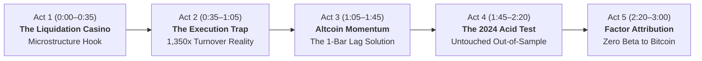

# Google Flow Video Storyboard & Director's Guide
## "Anatomy of an Alpha: Institutional Statistical Arbitrage in Digital Assets"
**Target Audience:** Quantitative Portfolio Managers, Trading Desks (Chicago Trading Company, Citadel, Jump Trading), and Recruiters  
**Format:** 3-Minute Cinematic Documentary Case Study (16:9 Broadcast Quality)  
**Tools Required:** [Google Flow (flow.google)](https://flow.google) + Generated Plots in `presentation_assets/plots/`

---

## Executive Production Overview: The 5-Act Narrative Arc



### Why This Format Beats a Standard Code Walkthrough
Standard student videos scroll through Jupyter notebooks with monotone commentary. High-performing quant trading desks look for **economic intuition, intellectual honesty, and clear risk communication**. 

This storyboard combines **Google Flow’s AI cinematic B-roll** (visualizing market mechanics) with **hard empirical evidence** from your exported Python plots, creating the feel of a **Bloomberg / Wall Street Journal documentary**.

---

## Scene-by-Scene Production Script & Director's Cue Sheet

### Act 1: The Liquidation Casino (0:00 – 0:35)
* **Theme:** Establishing the market inefficiency: retail leverage cascades on Binance & centralized derivatives exchanges.
* **Real-World Anecdote:** In May 2022 (Terra/Luna) and November 2022 (FTX), tens of billions of retail long positions were forcibly wiped out by automated exchange risk engines.

| Shot # | Timecode | Visual Asset & Screen Action | Google Flow / Veo Prompt (flow.google) | Voiceover Script (Narration) |
| :---: | :---: | :--- | :--- | :--- |
| **1.1** | `0:00 - 0:12` | **Flow AI Video:** Dark server racks, pulsing neon circuits, establishing atmosphere. | `Cinematic documentary shot, glowing high-frequency trading server racks in a dark data center, depth of field, neon teal and amber lights, slow camera push forward, 4k, photorealistic, 16:9.` | *"In cryptocurrency perpetuals, retail traders routinely take 20 to 50 times leverage. When the market moves against them, centralized exchange risk engines don't ask for permission—they take over the account."* |
| **1.2** | `0:12 - 0:22` | **Flow AI Video:** Sleek trading terminal, red candlesticks dropping sharply with volume spikes. | `Extreme close-up of a sleek digital trading terminal screen showing dark mode candlestick charts plunging in red, sudden dramatic liquidation volume spike, subtle reflection on screen, cinematic lighting, 16:9.` | *"The liquidation engine dumps aggressive market sell orders directly into the book. Bids disappear. Prices gap down far below equilibrium, accompanied by massive volume surges."* |
| **1.3** | `0:22 - 0:35` | **Plot Cut:** [`01_volume_conditioned_reversal_edge.png`](file:///Users/ayan/Programs/Quant/WSQ/To_Do/Crypto_StatArb_Project/presentation_assets/plots/01_volume_conditioned_reversal_edge.png)<br>*(Zoom in on the green line hitting 3.08 Sharpe)* | *Image-to-Video Mode in Flow:* `Slow camera pan across the green equity curve, crisp digital display, cinematic presentation.` | *"Once forced liquidations exhaust, liquidity returns and prices bounce. On paper, volume-conditioned mean reversion captures this dislocation with a staggering 3.08 annualized Sharpe ratio."* |

---

### Act 2: The Execution Friction Trap (0:35 – 1:05)
* **Theme:** The "Plot Twist" that proves your maturity as a quant researcher: high gross alpha $\neq$ executable net alpha.
* **Real-World Anecdote:** The classic trading desk rookie mistake: presenting a frictionless 4.0 Sharpe backtest that turns over 1,300 times per year and loses 270% in fees.

| Shot # | Timecode | Visual Asset & Screen Action | Google Flow / Veo Prompt (flow.google) | Voiceover Script (Narration) |
| :---: | :---: | :--- | :--- | :--- |
| **2.1** | `0:35 - 0:48` | **Flow AI Video:** Dramatic red emergency lights on a trading terminal, spinning execution fee counter. | `Cinematic close-up of a digital financial dashboard glitching with red warning metrics, spinning numerical data dials, high-frequency execution aesthetic, moody dramatic lighting, 16:9.` | *"Every novice quant thinks they discovered the holy grail in 4-hour mean reversion. But here is the dirty secret of high-frequency StatArb: turnover."* |
| **2.2** | `0:48 - 1:05` | **Plot Cut:** [`02_execution_friction_trap.png`](file:///Users/ayan/Programs/Quant/WSQ/To_Do/Crypto_StatArb_Project/presentation_assets/plots/02_execution_friction_trap.png)<br>*(Highlight the negative red bars at -4.80 Net Sharpe)* | *Image-to-Video Mode in Flow:* `Subtle camera push-in on the red bar chart, clean high-contrast dark fintech UI.` | *"Rebalancing every 4 hours generates over 1,350 times annual turnover. At standard 20 bps taker fees, fee drag exceeds 270% annually—crushing that 3.08 Sharpe down to negative 4.80. Academic gross alpha is an unexecutable friction trap."* |

---

### Act 3: Altcoin Momentum & The 1-Bar Lag Solution (1:05 – 1:45)
* **Theme:** Transitioning to intermediate-term cross-sectional momentum and fixing the microstructure bounce drag.
* **Real-World Anecdote:** Narrative diffusion across altcoins takes 2 to 3 weeks (Solana rally, Layer-1 rotation). But raw momentum fails because bar $t$ suffers from immediate bid-ask bounce.

| Shot # | Timecode | Visual Asset & Screen Action | Google Flow / Veo Prompt (flow.google) | Voiceover Script (Narration) |
| :---: | :---: | :--- | :--- | :--- |
| **3.1** | `1:05 - 1:20` | **Flow AI Video:** 3D connected network of glowing crypto tokens with moving capital streams. | `Abstract 3D digital financial network on a dark background, glowing connected nodes representing crypto assets with subtle glowing capital flows moving between them, elegant fintech motion graphics, 16:9.` | *"To survive real execution costs, we transition from short-term liquidity shocks to intermediate capital reallocation: a 21-day cross-sectional momentum strategy with daily rebalancing."* |
| **3.2** | `1:20 - 1:32` | **Flow AI Video:** High-tech data flow skipping a clock pulse, microsecond precision graphic. | `Macro shot of glowing optical data streams moving through fiber optic channels with microsecond pulse intervals, sleek futuristic technology, 16:9.` | *"Unlike equities, crypto narratives take weeks to diffuse. But raw momentum has a flaw: the most recent 4-hour bar is contaminated by order book bid-ask bouncing."* |
| **3.3** | `1:32 - 1:45` | **Plot Cut:** [`03_microstructure_horizon_scan.png`](file:///Users/ayan/Programs/Quant/WSQ/To_Do/Crypto_StatArb_Project/presentation_assets/plots/03_microstructure_horizon_scan.png)<br>*(Point to the red line at -3.80 vs. the blue line jumping to +1.63)* | *Image-to-Video Mode in Flow:* `Slow pan across the horizon scan curve, focusing on the blue line rising above the red line.` | *"By engineering a 1-bar lag—skipping the immediate 4-hour bar—we strip away microstructure drag. Turnover plummets by 88% down to just 76 times, and the Sharpe ratio jumps to positive 1.63."* |

---

### Act 4: The 2024 Out-of-Sample Acid Test (1:45 – 2:20)
* **Theme:** Walk-Forward rigor and out-of-sample parameter freezing (directly addressing CTC/mentor feedback).
* **Real-World Anecdote:** In 2024, the Spot Bitcoin ETF was approved, institutional inflows surged, and market dynamics transformed completely compared to the 2022–2023 bear market.

| Shot # | Timecode | Visual Asset & Screen Action | Google Flow / Veo Prompt (flow.google) | Voiceover Script (Narration) |
| :---: | :---: | :--- | :--- | :--- |
| **4.1** | `1:45 - 2:00` | **Flow AI Video:** A high-tech digital vault closing, securing data parameters under lock and key. | `Cinematic close-up of a digital security vault interface locking with glowing cybernetic grid lines, timestamped data freezing graphic, high tech 4k, 16:9.` | *"Anyone can overfit parameters in hindsight. To prove this edge is real, we instituted strict walk-forward discipline. All lookbacks, volume filters, and weights were calibrated strictly on 2022 to 2023 in-sample data."* |
| **4.2** | `2:00 - 2:20` | **Plot Cut:** [`04_walk_forward_oos_performance.png`](file:///Users/ayan/Programs/Quant/WSQ/To_Do/Crypto_StatArb_Project/presentation_assets/plots/04_walk_forward_oos_performance.png)<br>*(Focus on the yellow dashed line and the 2024 curve maintaining upward trajectory)* | *Image-to-Video Mode in Flow:* `Smooth horizontal tracking shot across the equity curve crossing the dashed partition line.` | *"Then, we ran the model blind on 2024: an untouched out-of-sample year featuring the institutional Bitcoin ETF launch and massive regime shifts. The strategy held up out-of-sample, generating positive risk-adjusted returns after all costs."* |

---

### Act 5: Factor Attribution & The CTC Pitch (2:20 – 3:00)
* **Theme:** Proving Zero Market Beta to Bitcoin, statistically significant Alpha ($t = 1.81$), and live execution.
* **Real-World Anecdote:** Chicago Trading Company and multi-strategy quant hedge funds don't buy beta. They demand market-neutral idiosyncratic alpha.

| Shot # | Timecode | Visual Asset & Screen Action | Google Flow / Veo Prompt (flow.google) | Voiceover Script (Narration) |
| :---: | :---: | :--- | :--- | :--- |
| **5.1** | `2:20 - 2:40` | **Plot Cut:** [`05_ols_factor_attribution_scorecard.png`](file:///Users/ayan/Programs/Quant/WSQ/To_Do/Crypto_StatArb_Project/presentation_assets/plots/05_ols_factor_attribution_scorecard.png)<br>*(Highlight Beta = 0.0013, Correlation = 0.0034, Alpha = +15.54%, t = 1.81)* | *Image-to-Video Mode in Flow:* `Slow cinematic zoom on the regression scorecard table highlighting the green metrics.` | *"Is this just disguised Bitcoin beta? We ran an OLS factor regression against Bitcoin across 1,096 trading days. Market Beta is 0.0013—statistically zero. Correlation is 0.0034. Annualized Alpha is plus 15.54% with a t-stat of 1.81."* |
| **5.2** | `2:40 - 2:52` | **Live Web Screencast:** Screen capture of the interactive Flask Web Scanner ([app.py](file:///Users/ayan/Programs/Quant/WSQ/To_Do/Crypto_StatArb_Project/app.py)) running at `localhost:5000`. | *Screen capture with cursor highlighting the live factor diagnostic table and portfolio weights.* | *"We also engineered a production-grade live web portfolio scanner that digests real-time exchange ticks and calculates cross-sectional factor exposures dynamically."* |
| **5.3** | `2:52 - 3:00` | **Flow AI Video / Ending Card:** Sleek quantitative trading floor, contact details, GitHub repository link. | `Slow tracking shot across a modern hedge fund quantitative trading desk with multi-monitor setup displaying real-time risk analytics, atmospheric cinematic lighting, 16:9.` | *"Validated out-of-sample, engineered for execution realities, and generating pure cross-sectional alpha. The full code and interactive lab are open on GitHub."* |

---

## Step-by-Step Google Flow (flow.google) Assembly Guide

### Step 1: Generate the AI B-Roll Clips
1. Go to [flow.google](https://flow.google) and start a new project.
2. Ensure the canvas setting is set to **`16:9`** aspect ratio.
3. In the prompt bar, paste each of the prompts from **Shots 1.1, 1.2, 2.1, 3.1, 3.2, 4.1, 5.3**.
4. Set camera motion to **`Slow Push In`** or **`Slow Pan`** for a steady documentary feel.
5. Generate and download each 4-to-8 second clip.

### Step 2: Animate Your High-Res Plots (Image-to-Video)
1. Select **Image-to-Video** mode in Flow.
2. Upload the corresponding PNG from `presentation_assets/plots/`:
   * `01_volume_conditioned_reversal_edge.png`
   * `02_execution_friction_trap.png`
   * `03_microstructure_horizon_scan.png`
   * `04_walk_forward_oos_performance.png`
   * `05_ols_factor_attribution_scorecard.png`
3. Prompt Flow:
   > `Slow subtle cinematic zoom-in on the financial chart, professional documentary motion graphic, clean high-resolution display, 16:9.`
4. This transforms your static plots into moving, broadcast-grade visuals!

### Step 3: Record the 10-Second Web App Clip
1. Start your local Flask server:
   ```bash
   python3 app.py
   ```
2. Open `http://localhost:5000` in Chrome.
3. Take a quick 10-second screen recording clicking on the **Factor Decomposition** and **Portfolio Scanner** buttons.

### Step 4: Add Voiceover and Export
1. Record the narration script above (or use high-quality TTS like ElevenLabs).
2. Drop all generated clips, animated plot clips, and the web screencast into the Flow timeline (or CapCut / Premiere).
3. Align each cut to the timecodes in the cue sheet.
4. Add a low-volume ambient electronic soundtrack (think *Social Network* or *Margin Call* OST).
5. Export in **1080p / 4K**.
